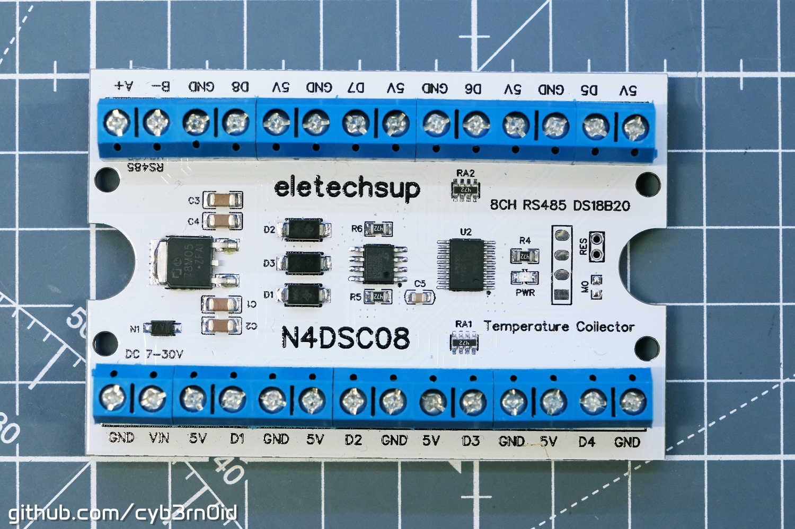

# N4DSC08

## 8 channel DS18B20 temperature collector

### Main Info

- Manufacturer: [Eletechsup](https://eletechsup.com/)
- Power Supply: 7÷30VDC
- Protected against reversed power supply: YES
- Optoisolated inputs: NO
- Max working Current: 18mA
- RS485 Default Config: 9600,N,8,1
- RS485 Default Address: 1
- Address changeable by: [x] RS485 command [ ] Hardware
- Address base: 0
- Start Address: 0
- Size (board only): 75 x 50 x 14mm
- Size (with DIN housing if available): 80 x 54 x 26mm
- Weight (board only): 36g
- Weight (with DIN housing if available): 66g
- Official Product Page: [N4DSC08](https://eletechsup.com/products/n4dsc08-8ch-rs485-ds18b20-sensor-temperature-collector-modbus-remote-io-module-for-plc-paperless-recorder-thermostatic-controls)
- Sponsored link for buying: n/a

### Chips on board

- **MCU** is a **PY32F002A** F15P (*TSSOP20 format*) a 32bit microcontroller having an ARM Cortex M0 core, manufactured by [Puya Semiconductors](https://www.puyasemi.com/)
- **RS485 transceiver** is a **CS48520S** manufactured by [ChipAnalog](https://e.chipanalog.com/products/interface/interface/interface3/1178)
- **Voltage Regulator**  is a 78M05

### Other info

- **Reset** possible shorting RES pads for 5 seconds. RES connects GND to pin 9 (PF1) of the mcu
- There is a pad marked as M0, which function is unknown, connecting GND and pin 8 (PF0) of the mcu
- The 4-pads in the square are used at the factory for the MCU programming. The pinout (starting from the square pad, followed by 3 rounded pads) is: GND, SWC (pin3), SWD (pin2), 5V
- Sensor Data lines are connected to the MCU as follow:
  
  - D1 ⇒ pin 19 (PB1)
  - D2 ⇒ pin 15 (PA4)
  - D3 ⇒ pin 14 (PA3)
  - D4 ⇒ pin 07 (PA5)
  - D5 ⇒ pin 10 (PF2)
  - D6 ⇒ pin 11 (PA0)
  - D7 ⇒ pin 12 (PA1)
  - D8 ⇒ pin 13 (PA2)

### Registers

Registers have always a length of 2 bytes unless otherwise specified

#### Input Registers (3x, FC:4=read)

| DEC | HEX | Function                   |
| --- | --- | -------------------------- |
| 0   | 0   | Temperature  value from D1 |
| 1   | 1   | Temperature  value from D2 |
| 2   | 2   | Temperature  value from D3 |
| 3   | 3   | Temperature  value from D4 |
| 4   | 4   | Temperature  value from D5 |
| 5   | 5   | Temperature  value from D6 |
| 6   | 6   | Temperature  value from D7 |
| 7   | 7   | Temperature  value from D8 |

**Notes**

- Temperature value type is INT16
- Temperature is expressed as °C multiplied 10 (so a value of 182 means 18.2°C)
- If the value from a temperature register is -32768 (0x8000) means sensor is not connected or sensor is broken/don't communicate. See Troubleshooting paragraph

#### Holding Registers (4x, FC:3=read, 6=write)

| DEC | HEX | Default | Read Only | Description                                           |
| --- | --- | ------- | --------- | ----------------------------------------------------- |
| 160 | A0  |         | x         | Temperature  value from D1                            |
| 161 | A1  |         | x         | Temperature  value from D2                            |
| 162 | A2  |         | x         | Temperature  value from D3                            |
| 163 | A3  |         | x         | Temperature  value from D4                            |
| 164 | A4  |         | x         | Temperature  value from D5                            |
| 165 | A5  |         | x         | Temperature  value from D6                            |
| 166 | A6  |         | x         | Temperature  value from D7                            |
| 167 | A7  |         | x         | Temperature  value from D8                            |
| 243 | F3  | 0       |           | Write 1 here if sensor wires are longer than 5 meters |
| 244 | F4  | 10      |           | ?                                                     |
| 245 | F5  | 0       |           | ?                                                     |
| 252 | FC  | 0       |           | ?                                                     |
| 253 | FD  | 1       |           | RS485 Address                                         |
| 254 | FE  | 3       |           | Baudrate (3=9600)                                     |
| 255 | FF  | 0       |           | ?                                                     |

**Notes**

- As you can see, temperature values from sensors is duplicated in Holding Registers starting from address `4 0160` (`4x 00A0`)
- Registers from `246` (`F6`) to `251` (`FB`) are always 0 and they are not writable (if you try to write a value to them, it will not cause errors but registers will remain unchanged to 0)
- Address change is effective as soon is executed, so the board don't need a restart for acquiring the new Address / Unit ID
- The Baudrate setting probably follow other similar boards from the same manufacturer (like the R4DCB08) so I can suppose (but I have not tested this):
  
  - 0 ⇒ 1200
  - 1 ⇒ 2400
  - 2 ⇒ 4800
  - 3 ⇒ 9600 (default)
  - 4 ⇒ 19200

- Descriptions I wrote as '?' means that changing the value in the corrispondent register does not apparently have any effect (value is written but I don't see any change in board beahaviour)
- Like similar boards from the same manufacturer, I'd expect there is some register that can do the temperature correction

### Troubleshooting

- If you're sure sensor is good (it works with other devices) and it's properly connected, but you're not able to read temperature value (you always obtain -32768/0x8000), try to write 1 in the register `4 0253`
- Data lines for each sensors are pulled up by resistor arrays marked as RA1 and RA2: they're array of 4x 4.7kΩ resistors. If you still cannot read temperature from sensor after the change in register `4 0253` you can try to lower the resistance under to 3.9kΩ or 2.7kΩ
