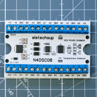

# Modbus Devices

My own notes and discoverings about Modbus devices I'm working with.

## Modbus cheatsheet table

| Register Prefix (Modicon Notation) | Description                                                      | Usable Function Codes (FC)                              |
| -------------------------------------- | ---------------------------------------------------------------- | ------------------------------------------------------- |
| **0x**                                 | Coils or Discrete Inputs (digital outputs)                   | **1**: read **5**: write **15**: write multiple |
| **1x**                                 | Input Status or Discrete Inputs (digital inputs)             | **2**: read                                             |
| **3x**                                 | Input Register (values from analog sensors)                  | **4**: read                                             |
| **4x**                                 | Holding Register or Keep Register (configuration parameters) | **3**: read **6**: write **16**: write multiple |

**Client** (Modbus *TCP*) = **Master** (Modbus *RTU*) : device who requests data or sends configuration parameters to devices (PLC)

**Server** (Modbus *TCP*) = **Slave** (Mosbus *RTU*) : device who transmits data, actuator, relay, sensor, IO board etc

## Device list

| Image                   | Name                         | Description                             |
| ----------------------- | ---------------------------- | --------------------------------------- |
|  | [N4DSC08](N4DSC08/README.md) | 8 channel DS18B20 temperature collector |
